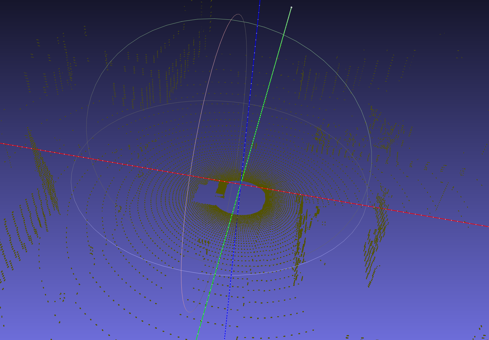
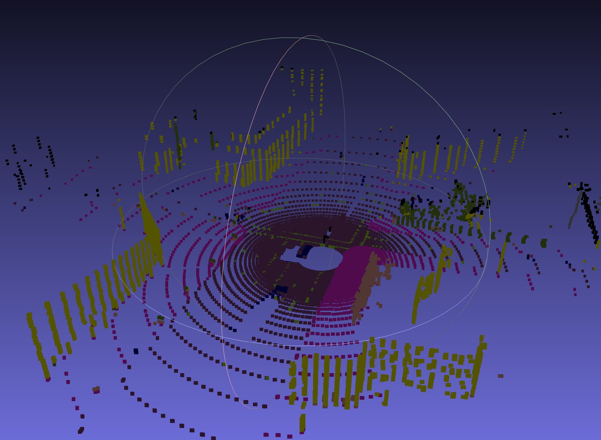

# README

## Usage

The code is for CARLA version 0.9.4. It needs to be modified to adapt to other versions of CARLA.

### Data Generation

1. Copy files in "poseprocesseffect" to "carla_root_folder/Unreal/CarlaUE4/Plugins/Carla/Content/PostProcessingMaterials" and **recompile carla**.

2. put "collect_albedo_depth_normal.py" to "carla_root_folder/PythonAPI/examples" and run it using terminal. You can modify the code to generate the lidar point cloud and the semantic image for front view, left view, right view and rear view simultaneously(just uncomment some lines).

3. data will be created in folder "carla_root_folder/PythonAPI/examples/images"

### Point cloud processing

After generation of the semantic image for front view, left view, right view and rear view and the lidar point cloud at the same time step, you may want to generate the semantic point cloud(point cloud with different colors according to their semantic meanings). The usage is as below:

1. Install `plyfile`

```bash
pip install plyfile
```

2. Go to folder `lidar_processing`. Make sure the semantic image data generated in `Data Generation` part are .npy format(in the repository the .npy file is too big to attach, so I put the .png image for visualization) and the lidar point is in .ply format.

```bash
cd ./lidar_processing
```

3. If you want to convert .npy file of semantic image into .png file for better visualization, you can run the `npy2png.py` file.

```bash
python npy2png.py
```

4. You can run the following to generate semantic lidar points. The results will be in `./data/for_training/2019-05-31_22_05/Lidar/labeled/`.

```bash
python add_lidar_label.py
```

The semantic point cloud will have the following look:


original lidar


labeled lidar
